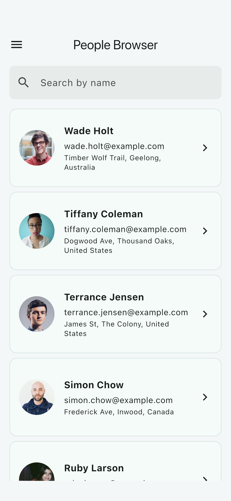
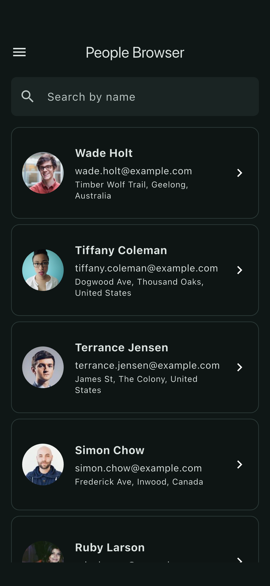
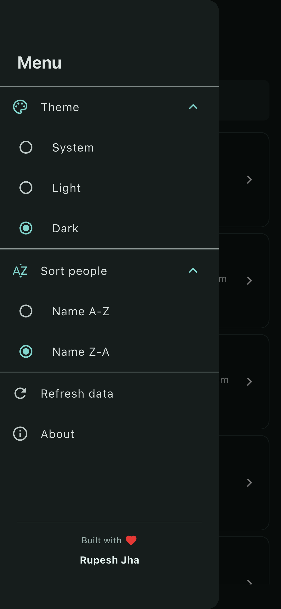
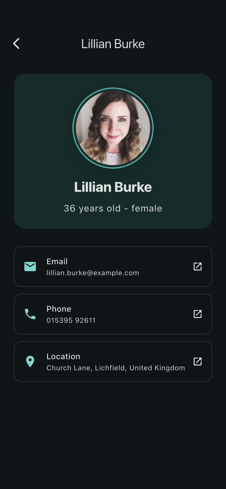
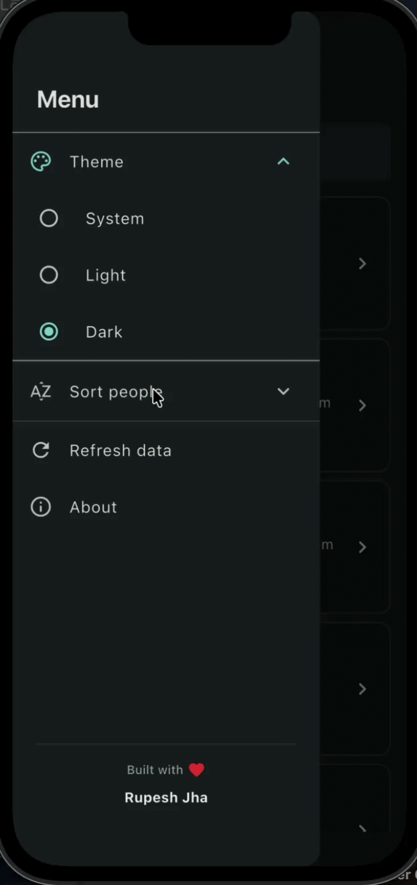

# People Browser

A Flutter app for browsing deterministic user profiles from the Random User API with search, sorting, pull-to-refresh, detail actions, and light or dark theming.

This project is intentionally small, but it is not structured like a throwaway demo. It uses a layered architecture with `flutter_bloc`, clear data flow, and enough separation to scale into caching, persistence, pagination, and stronger UI test coverage.

## Preview

<p align="center">
  
  
  
</p>

<p align="center">
  
</p>

<p align="center">
  
</p>

## What It Does

- fetches a stable list of people from `https://randomuser.me/api/`
- shows polished loading, empty, loaded, and error states
- supports debounced client-side search by full name
- supports pull-to-refresh and manual retry on failure
- supports ascending and descending name sorting
- opens a detail page with age, gender, email, phone, and location
- launches email, phone, and map actions from the detail screen
- supports light, dark, and system theme modes

## Why This Project Is Useful

This codebase works well as a compact reference for:

- layered Flutter architecture
- `flutter_bloc` state management
- mapping remote JSON into domain entities
- handling UI state transitions cleanly
- building a small app with production-minded structure

## Architecture

The main request flow is:

```text
UI -> PeopleBloc -> GetPeople -> PeopleRepository -> PeopleRemoteDataSource -> UserService -> Random User API
```

Layer responsibilities:

- `presentation`: pages, widgets, bloc, cubit, and UI state transitions
- `domain`: entities, repository contracts, and use cases
- `data`: API calls, DTO/model mapping, datasource, and repository implementation
- `core`: shared constants, theme setup, and app exceptions

## Key Product Behavior

### Data Fetching

- uses the public Random User API
- requests `30` users per load
- uses a fixed seed of `people-browser`
- limits nationalities to `us,gb,ca,au`

The fixed seed keeps the dataset stable enough for development, screenshots, and test assertions.

### Search And Sort

- search runs locally on the fetched dataset
- search input is debounced for smoother interaction
- sorting currently supports:
  - name ascending
  - name descending

### Error Handling

- server responses with status codes are converted into user-facing error messages
- network-like failures surface a retry message
- retry is currently manual by design

## Project Structure

```text
lib/
  core/
    constants/
    errors/
    theme/
  data/
    datasources/
    models/
    repositories/
    services/
  domain/
    entities/
    repositories/
    usecases/
  presentation/
    bloc/
    pages/
    widgets/
test/
  people_bloc_test.dart
  user_model_test.dart
docs/
  images/
```

## Tech Stack

- Flutter
- Dart
- `flutter_bloc`
- `dio`
- `cached_network_image`
- `url_launcher`

## Getting Started

### Prerequisites

- Flutter SDK
- a simulator, emulator, browser, or physical device

### Install Dependencies

```sh
flutter pub get
```

### Run The App

```sh
flutter run
```

### Run On A Specific Device

```sh
flutter devices
flutter run -d <device-id>
```

## Quality Checks

Analyze the project:

```sh
flutter analyze
```

Run tests:

```sh
flutter test
```

## Test Coverage

Current coverage includes:

- BLoC state transitions for loading, error, search, and sort
- API model parsing into app models

Current gaps:

- widget tests for main page states
- repository tests for Dio error translation
- integration tests for full app navigation flow

## Design And Implementation Notes

### Why `flutter_bloc`

The app has explicit event-driven transitions like load, refresh, retry, search, and sort. `flutter_bloc` keeps those transitions testable and easy to reason about.

### Why A Fixed API Seed

Without a fixed seed, the API would return a different result set frequently, which makes screenshots, UI verification, and tests noisier than necessary.

### Why Client-Side Search

The fetched dataset is intentionally small, so client-side filtering keeps the implementation simple and responsive.

## Known Limitations

- no offline caching or persistence yet
- no pagination or infinite scroll
- theme preference is not persisted across app restarts
- error classification is still broad
- search and sort only apply to the current fetched dataset

## Roadmap

High-value next improvements:

- persist theme preference locally
- add favorites or bookmarks
- cache the last successful people list
- improve timeout, offline, and server error messaging
- split larger UI files into smaller widgets
- add widget and integration tests

## API

This project uses the public [Random User API](https://randomuser.me/).
